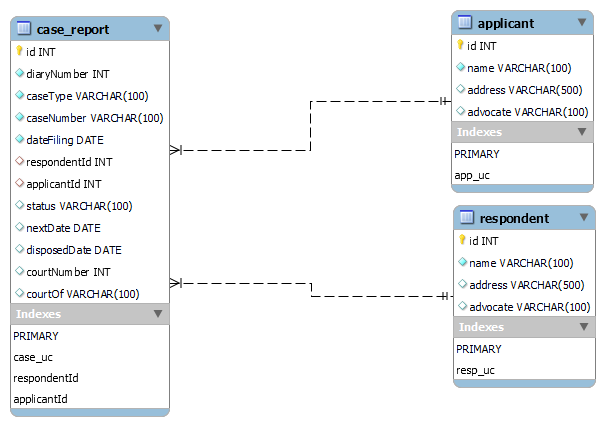

# DRT Scraping

Scraping DRT Portal for cases information using BeautifulSoup and resolving captcha using Pytesseract.
The scraped information is then stored in a backend database (MySQL here).

## API Structure

1. `/scrape-cases` Type - **POST** - Accepts the following parameters
    1. DRT Name - `drt_name` - Name of the DRT from which data is to be scraped. For list refer to the dropdown on [link]("https://drt.gov.in/front/page1_advocate.php")
    2. Party Name - `party_name` - Name of the party  
       Example request -  
        {  
        "drt_name": "DEBT RECOVERY APPELLATE TRIBUNAL - DELHI",  
        "party_name": "har"  
        }

## Model Structure

## Setup instructions

1. If not using Docker

    1. Install and Setup Tesseract OCR. Installation instructions can be found [here]("https://github.com/tesseract-ocr/tesseract")
    2. Install pip requirements using `pip install -r requirements.txt`
    3. Set Tesseract OCR executable Path in file `scrape.py`
    4. Set Database Username, Password, IP in file `scrape.py`
    5. Run `python scrape.py`

2. If using Docker
    1. Install and setup docker and docker-compose.
    2. Execute `docker-compose -p drt up -d` to bring up the flask app and mysql db container.

API will be accessible on `<IP>:8080/scrape-cases`
